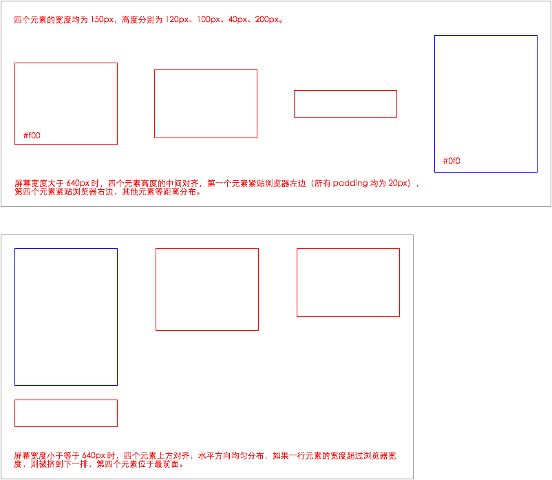
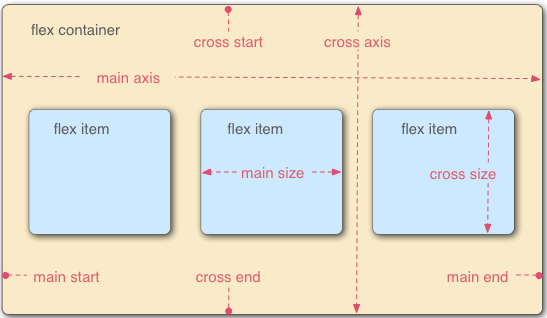

# 任务十：Flexbox 布局练习

[题目](http://ife.baidu.com/course/detail/id/114)

[预览](https://theaao.github.io/baidu_ife_tasks/xiaowei_academy/task10/task10.html)

[代码](https://github.com/TheaAo/baidu_ife_tasks/blob/master/xiaowei_academy/task10/task10.html)

## 任务目的

- 学习如何flex进行布局，学习如何根据屏幕宽度调整布局策略。

- 任务描述

    - 实现响应式效果——屏幕宽度小于 640px 时，调整 Flexbox 的属性以实现第四个元素移动到最前面的效果，而不要改动第一个元素的边框颜色与高度实现效果图。

    - 效果图如下

    

## 笔记

Flexbox 是继 block layout、inline layout、table layout 和 position layout 后出现的一种新的布局方式，能够快速进行复杂布局。

### 如何使用 flexbox 进行布局

### 开始

Flexbox 包括两个部分—— flex container 和 flex items。所以首先需要将待布局的元素置于一个容器元素中，然后设置容器元素 display: flex, 然后即可开始布局。

容器中的元素依据两根轴线进行布局—— main axis 和 cross axis，初始时 main axis 一般为从左至右的水平轴线，cross axis 为从上至下的垂直轴线，两条轴线的构成类似上下翻转 180 度的坐标系。两条轴线的四个方向分别称作 main start、main end、cross start、cross end。如下图。

除了 display 外，flexbox 还有一系列相关属性，有些适用于 container, 有些适用于 items。

### 用于 container 的属性

flex-direction: row/column/reverse-row/reverse-column  确定主轴方向。

flex-wrap: wrap/nowrap/reverse-wrap 决定容器内元素超出容器时是否换行。

以上两个属性可简写为 flex-flow。

align-items: flex-start/flex-end/center/baseline/stretch 决定 cross axis 方向的元素排列。值为 baseline 是所有元素的基线在同一水平线上。

justify-content: flex-start/flex-end/center/space-between/space-around 决定 main axis 方向的元素排列。

align-content: flext-start/flex-end/center/space-between/space-around/space-evenly/stretch 仅适用于具有多行 flex items 的容器。决定行在 cross axis 上的排列方式。

### 用于 items 的属性

flex-basic: <width\>/content 决定一个 item 的最小尺寸，或者说初始尺寸。

flex-grow: <number\> 不带单位，flex item 的 grow factor。

flex-shrink: <number\> 与 flex-grow 相对，是 shrink factor。

以上三个属性可简写为 flex, 推荐使用简写。

align-self: flex-start/flex-end/center/stretch/baseline/auto 可重写容器的 align-item 值，仅用于自身。

order: <number\> 决定 item 的排列顺序，默认值均为 0。设置后按照 order 值从小到大排列，等值时按照元素在文档中的本来顺序排列。

## 在线学习参考资料

[MDN flexbox](https://developer.mozilla.org/en-US/docs/Learn/CSS/CSS_layout/Flexbox)