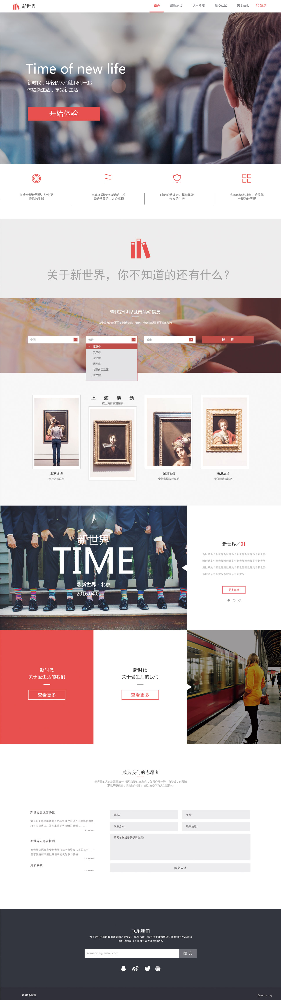

# 任务七：实现常见的技术产品官网的页面架构及样式布局

[题目](http://ife.baidu.com/course/detail/id/102)

[预览](https://theaao.github.io/baidu_ife_tasks/xiaowei_academy/task7/task7.html)

[代码](https://github.com/TheaAo/baidu_ife_tasks/tree/master/xiaowei_academy/task7)

## 任务描述

* 通过HTML及CSS实现设计稿，效果如图

* 设计稿是有一定宽度的，这个宽度为页面的最小宽度，也就是说，当浏览器窗口宽度小于设计稿宽度时，允许出现横向滚动条，页面内容宽度保持不变，但是当浏览器窗口宽度大于设计稿宽度时，页面部分内容的宽度应该保持和浏览器窗口宽度一致。

* 只需要完成HTML，CSS代码编写，不涉及JavaScript.

## 笔记

继续了解到了很多之前只是泛泛知道的 CSS 知识点，主要是背景和伪类伪元素方面的。

### 与背景有关的CSS属性

- 常用的设置背景的属性是 background-color 和 background-image。

- 用图片做背景时，可以通过设置 background-size 和 background-repeat 来决定图片填充背景的方式。可以使用多张图片做背景，这些图片会叠起来，越在前，越在上。

- 使用 background-image 也可以设置纯色背景（ image(\<color\>) ），也可以设置渐变色背景（linear-gradiant()/radial-gradiant()）。

- background-color 的值的格式（和 color 一样），包括六位十六进制数（#xxxxxx）、rgb()、hsl()、rgba()、hlsa() 以及部分颜色名（transparent 是颜色名的一种，表示透明背景）。

- 与背景相关的系列属性还有 background-attachment/background-clip/background-origin/bacground-position/background-repeat/background-size

### 伪类和伪元素

- **伪类，是对紧在冒号前面的元素的修饰。**

    比如 a:hover 指的是鼠标指针停留时的 <a\> 元素。

    而 div:first-child 指的是“作为第一个子元素的 div” 而不是“div的第一个子元素”。

- **而伪元素，则是指代紧在冒号之前的元素的子元素。**

    比如 p::first-line 指的是段落的第一行。

    表单控件除了文本框和按钮外，样式都不大好修改，难以保证跨浏览器的统一性。所以页面中的下拉选择是自己重写的，没有用表单的 <select\> 标签。需要 JavaScript 控制实现下拉菜单的效果。

## 在线资源

[MDN HTML入门](https://developer.mozilla.org/zh-CN/docs/Web/Guide/HTML/Introduction)

[MDN CSS入门](https://developer.mozilla.org/zh-CN/docs/Web/Guide/CSS/Getting_started)

[慕课网：前端工程师必备的PS技能——切图篇](http://www.imooc.com/learn/506)
