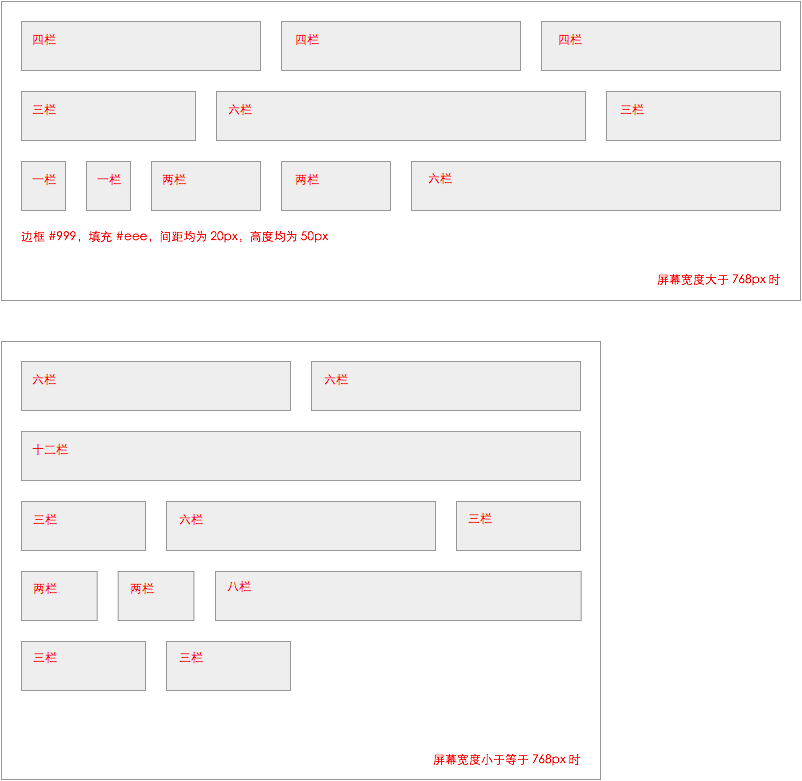

# 任务八：响应式网格（栅格化）布局

[题目](http://ife.baidu.com/course/detail/id/104)

[预览](https://theaao.github.io/baidu_ife_tasks/xiaowei_academy/task8/task8.html)

[代码](https://github.com/TheaAo/baidu_ife_tasks/tree/master/xiaowei_academy/task8/task8.css)

## 任务目的

- 使用 HTML 与 CSS 实现类似 BootStrap 的响应式 12 栏网格布局，根据屏幕宽度，元素占的栏数不同。

- 实现大于 768px 和小于等或等于 768px 宽度下的弹性布局

- 最终效果应如下图

## 笔记

- 利用 float 建立简单的网格系统。

- 利用 calc() 计算，创造弹性布局

- 利用媒体查询实现不同屏幕大小下布局的切换

P.S.还可以利用 CSS3 中的 flexbox 以及更新的 grid 进行布局，但需要适当考虑兼容性

## 资料

[Bootstrap 官网](http://getbootstrap.com/)
